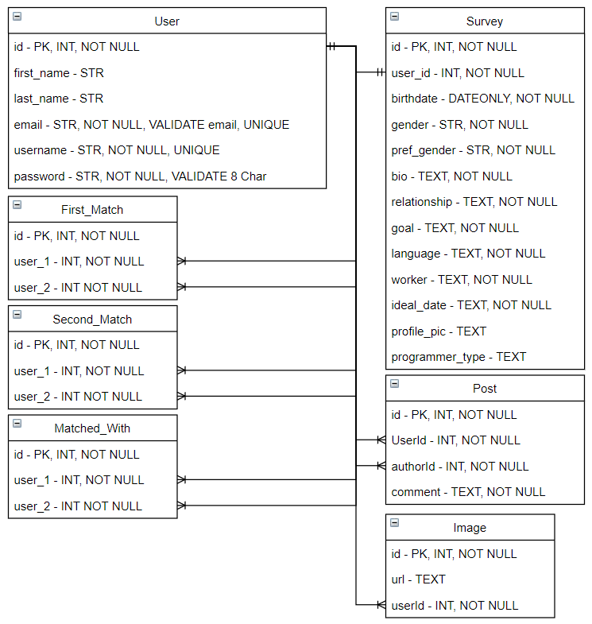

# Coder-Mingle
## Description
A dating website for people who code. This website uses the following NPM packages:
- bcrypt
    - Used to encrypt a user's password.
- coludinary
    - Allows users to upload images to the site.
- connect-session-sequelize
    - Stores session data in the SQL database
- dovenv
    - Loads environment variables from a .env file.
- express
    - Web framework for node
- express-handlebars
    - A Handlebars view engine for Express
- express-session
    - Creates cookie information
- handlebars
    - An extension to the mustache templating language.
- mysql2
    - Connect to a SQL database
- nodemailer
    - Used to send emails from node.
    - On this site it's part of the error logging. If there's an error on the site, the error is logged and an e-mail is sent infroming the admin that there's an error.
- sequelize
    - A promise-based node tool for MySQL
## Usage
- Website - [Coder-Mingle](https://coder-mingle.herokuapp.com/) 
- API Links
    - [Website Errors](https://coder-mingle.herokuapp.com/api/errors)
    - [Users](https://coder-mingle.herokuapp.com/api/users)
    - [Images](https://coder-mingle.herokuapp.com/api/images)
    - Matches
        - [Pending](https://coder-mingle.herokuapp.com/api/matches/first)
        - [Approved](https://coder-mingle.herokuapp.com/api/matches/second)
  

## Credits
Charlotte Hulseman - [GitHub Profile](https://github.com/charlottehulseman)  
Julian Voros - [GitHub Profile](https://github.com/JuVoros)  
Sherry Zheng - [GitHub Profile](https://github.com/sherryzheng2018)  
Zach Smith - [GitHub Profile](https://github.com/Lemelisk27)  